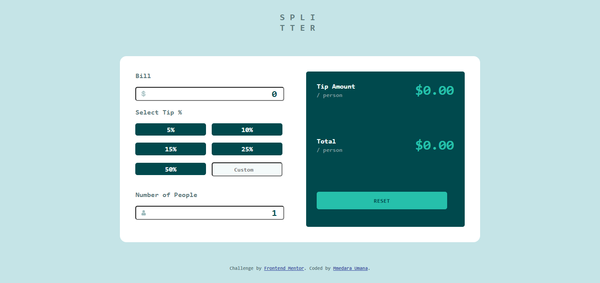
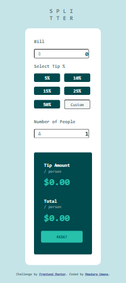

# Frontend Mentor - Tip calculator app solution

This is a solution to the [Tip calculator app challenge on Frontend Mentor](https://www.frontendmentor.io/challenges/tip-calculator-app-ugJNGbJUX). Frontend Mentor challenges help you improve your coding skills by building realistic projects.

## Table of contents

- [Frontend Mentor - Tip calculator app solution](#frontend-mentor---tip-calculator-app-solution)
  - [Table of contents](#table-of-contents)
  - [Overview](#overview)
    - [The challenge](#the-challenge)
    - [Screenshot](#screenshot)
    - [Links](#links)
  - [My process](#my-process)
    - [Built with](#built-with)
    - [My experience](#my-experience)
    - [Continued development](#continued-development)
    - [Useful resources](#useful-resources)
  - [Author](#author)

## Overview

### The challenge

Users should be able to:

- View the optimal layout for the app depending on their device's screen size
- See hover states for all interactive elements on the page
- Calculate the correct tip and total cost of the bill per person

### Screenshot





### Links

- Solution URL: [Add solution URL here](https://your-solution-url.com)
- Live Site URL: [Add live site URL here](https://your-live-site-url.com)

## My process

### Built with

- Semantic HTML5 markup
- Sass/SCSS
- Flexbox
- Desktop-first workflow

### My experience

Finally completed this using a tutorial, though I changed some things based on what I have learnt on my own.

Got to practice interpolation
```Js
tipPerPerson.innerText = `$${0.0.toFixed(2)}`;
```
This project helped me see what I could achieve with what I've learnt so far. Back to learning.

### Continued development

I want to try building my next project without a tutorial. 

### Useful resources

- [My Study Notes](https://github.com/MmedaraU/cheatsheets) - Helped refresh my memory on things I had forgotten.
- [Tip calculator tutorial](https://www.example.com) - Helped me figure out the places I had made mistakes after I initially tried by myself and helped me finish the project.
- [Brad Traversy JS Crash Course for Beginners]() - One of the resources I've been using to learn JS.


## Author
- Frontend Mentor - [@MmedaraU](https://www.frontendmentor.io/profile/MmedaraU)
- Twitter - [@MmedaraUmana](https://twitter.com/MmedaraUmana)
- Github - [MmedaraU](https://github.com/MmedaraU)